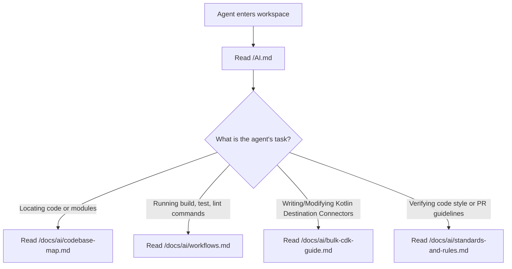

# Design Specification: AI Agent Documentation System (AI-optimized Docs)

**Date:** 2026-07-17  
**Status:** Approved by User  
**Target Path:** `docs/superpowers/specs/2026-07-17-ai-agent-docs-system-design.md`  

---

## 1. Introduction & Objectives

This document defines the architecture, content outlines, and design principles for building a specialized **AI Agent Documentation System** (AI-optimized Docs) in the `Gena-AI/airbyte` repository. 

Modern coding agents (e.g., Claude Code, Antigravity, Cursor, Copilot) are highly capable but can easily consume excessive tokens or lose context when navigating massive repositories like Airbyte. This documentation system aims to:
- Establish a single, lightweight entry point (`AI.md` at root) to orient any AI agent immediately.
- Create a dedicated directory (`docs/ai/`) containing dense, cheat-sheet-style resources containing absolute file paths, copy-pasteable commands, architecture overviews, and strict coding rules.
- Reduce agent token consumption and edit cycles by eliminating the need for extensive directory traversal or reading of multiple massive files.

---

## 2. Directory & Routing Architecture

The documentation system will be organized as follows:

```
airbyte/ (Repository Root)
├── AI.md                                    # Root index/routing file for AI agents
└── docs/
    └── ai/                                  # Dedicated AI documentation folder
        ├── codebase-map.md                  # Compact map of core directories and modules
        ├── workflows.md                     # Command-line cheat-sheet for build, run, test
        ├── bulk-cdk-guide.md                # Specialized guide for Kotlin Bulk (Dataflow) CDK
        └── standards-and-rules.md           # Coding standards, error handling, and PR guidelines
```

### Agent Navigation Flowchart


---

## 3. Detailed Document Outlines (High-Density Content)

### 3.1. `AI.md` (Root Cổng định tuyến)
- **Role:** Main index and system instruction for AI.
- **Key Sections:**
  - **Quick Navigation Matrix:** A table mapping agent tasks (e.g., debugging, connector development, pull request preparation) to specific files under `docs/ai/`.
  - **Core Guardrails:** High-level non-negotiable rules (e.g., "Always use `docs/ai/standards-and-rules.md` code style", "Never change CDK versions without explicit instructions").

### 3.2. `docs/ai/codebase-map.md` (Bản đồ Codebase)
- **Role:** High-level guide to repository organization.
- **Key Sections:**
  - **Trimmed Directory Tree:** A clean text-based directory hierarchy of only developer-relevant folders.
  - **Module Directory Guide:**
    - `airbyte-cdk/bulk/`: Kotlin Bulk/Dataflow CDK.
    - `airbyte-integrations/connectors/`: Codebase for all connectors (Sources and Destinations).
    - `connector-writer/destination/`: Guides on writing Kotlin destination connectors (critical reference).
    - `.claude/`: Custom agent-facing skills and automation configurations.

### 3.3. `docs/ai/workflows.md` (Bộ cẩm nang câu lệnh)
- **Role:** Drop-in shell command cheat-sheet.
- **Key Sections:**
  - **Gradle & JVM Workflows:** Build and test commands for Kotlin connectors and Bulk CDK:
    - Clean build: `./gradlew clean build -x test`
    - Build specific project: `./gradlew :airbyte-cdk:bulk:core:build`
    - Run unit tests: `./gradlew :airbyte-cdk:bulk:core:test`
    - Run integration tests for a connector: `./gradlew :airbyte-integrations:connectors:destination-clickhouse:integrationTest`
  - **Python & Connector-level Workflows:** Commands for Python connector setups (Poetry, unit tests).
  - **Docker & Local execution:** Commands to build and execute Docker images locally to verify connectors.
  - **Formatting & Linting:** Running spotless and pre-commit checks before pushing code.

### 3.4. `docs/ai/bulk-cdk-guide.md` (Kiến trúc Kotlin Bulk CDK)
- **Role:** Condensed architectural mental-model for Kotlin Destination development.
- **Key Sections:**
  - **Core Component Patterns:**
    - `SqlGenerator`: Pure functions for SQL syntax generation (extremely easy to unit test).
    - `TableOperationsClient`: Safe SQL execution and schema queries.
    - `InsertBuffer`: High-performance batched inserts.
    - `StreamLoader`: Controls table write lifecycles (Append, Overwrite, Dedupe).
    - `Writer`: High-level entry point orchestrating the entire lifecycle.
  - **Micronaut Dependency Injection (DI):** Rules for registering beans, using factory patterns, and resolving common Micronaut injection failures.
  - **Critical Test Contexts:** High-density breakdown of:
    - *Component Tests:* Lightweight, database-focused tests using Testcontainers (e.g., test SQL queries directly).
    - *Integration Tests:* Verifying write initialization, StreamLoader mapping, and DI registration.
    - *Basic Functionality Tests:* End-to-end integration tests validating all sync modes and schema evolution.

### 3.5. `docs/ai/standards-and-rules.md` (Tiêu chuẩn code & Quy tắc PR)
- **Role:** Best practices, quality gates, and anti-patterns.
- **Key Sections:**
  - **Coding Style:** Spotless configuration for Kotlin, Ruff for Python. Preservation of existing comments/docstrings.
  - **Error Handling & Security:** Rule of exception translation. Credentials must be stripped or securely handled (never leak secrets in stdout or logs).
  - **PR Guidelines:** Requirement to check the "Allow edits from maintainers" checkbox, use personal forks instead of organization accounts for PRs.
  - **Common Anti-Patterns:**
    - Modifying/upgrading CDK versions without pinning checks.
    - Overcomplicating database writes instead of using CDK-provided `StreamLoader` structures.
    - Bypassing Micronaut DI via manual instantiation where bean injection is expected.

---

## 4. Implementation Guidelines for the Creator Agent

When implementing these markdown files:
1. **No Placeholders:** Avoid any `TODO`, `TBD`, or vague instructions. Every command and path must be fully qualified and accurate based on the current repository's actual layout and tools.
2. **Dense & Visual:** Use Mermaid diagrams, concise tables, and exact code snippets to convey meaning.
3. **Save and Commit:** All newly created files under `docs/ai/` and `/AI.md` should be saved, verified, and committed to Git.
